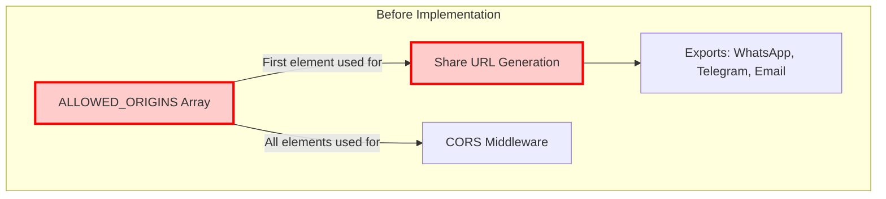
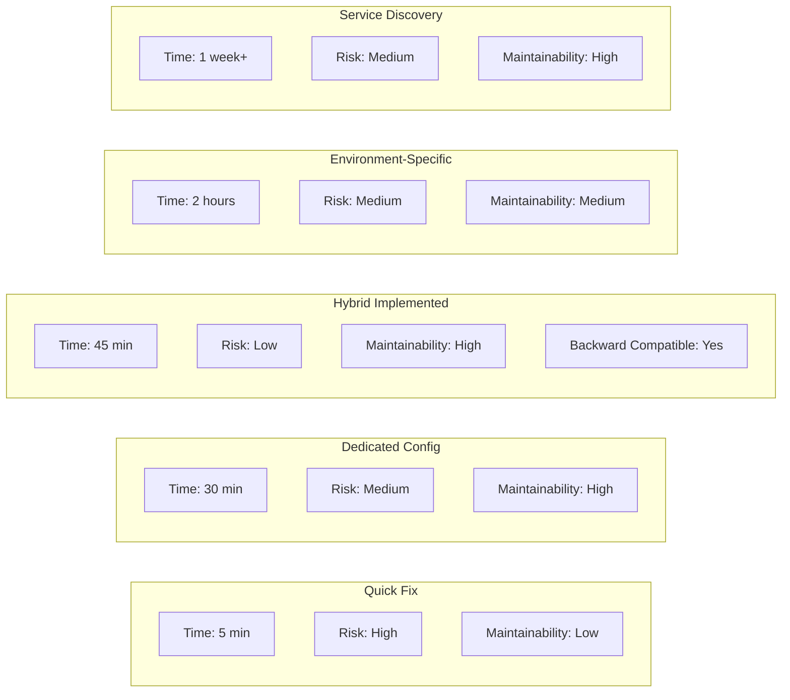
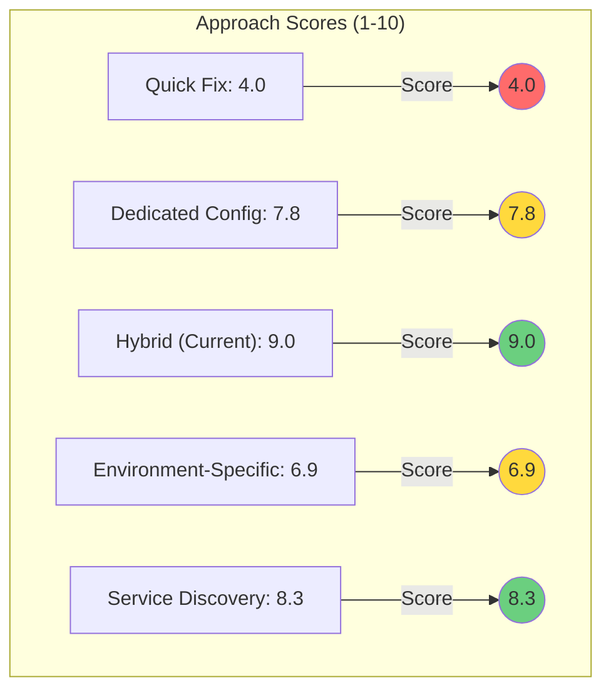
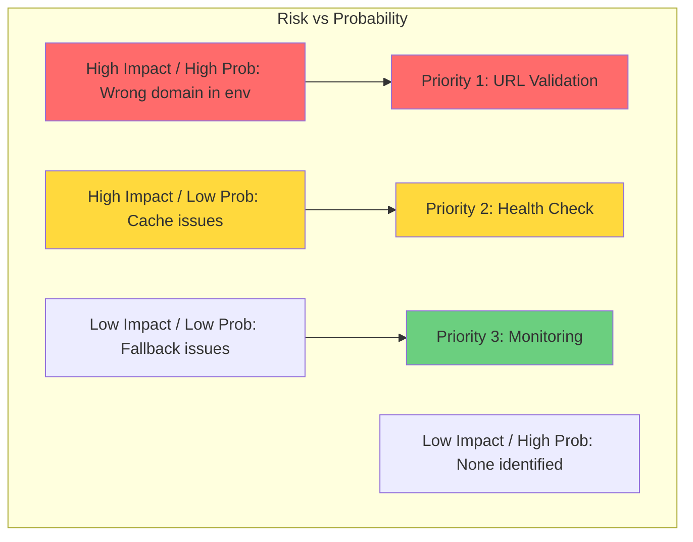
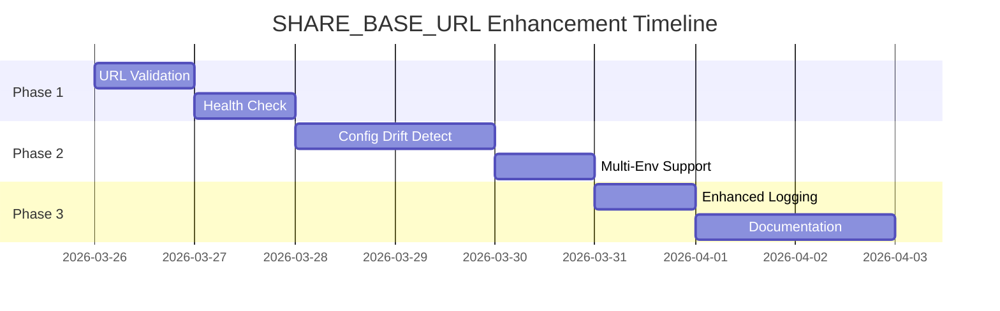

# SHARE_BASE_URL Approach Comparison Diagrams

**Date**: 2026-03-26  
**Purpose**: Visual comparison of configuration approaches

---

## Architecture Comparison

### Before: Implicit Coupling



**Problem**: Share URLs implicitly depend on CORS configuration array ordering

---

### After: Explicit Configuration

```mermaid
graph TB
    subgraph "After Implementation"
        A[ALLOWED_ORIGINS Array]
        B[CORS Middleware]
        C[SHARE_BASE_URL Optional]
        D[Share URL Generator]
        E[Exports: WhatsApp, Telegram, Email]
        
        A -->|All elements| B
        C -->|Explicit or fallback| D
        D --> E
        
        F{Fallback Logic}
        G[Priority 1: SHARE_BASE_URL]
        H[Priority 2: ALLOWED_ORIGINS[0]]
        I[Priority 3: localhost:3000]
        
        D --> F
        F --> G
        G -->|Not set| H
        H -->|Not set| I
        
        style C fill:#90EE90
        style D fill:#90EE90
        style F fill:#87CEEB
    end
    
    style C stroke:#00aa00,stroke-width:3px
    style D stroke:#00aa00,stroke-width:3px
```

**Solution**: Share URLs have explicit configuration with intelligent fallback

---

## Decision Flow

```mermaid
flowchart TD
    Start[Need Share Base URL] --> Check{SHARE_BASE_URL set?}
    
    Check -->|Yes| Explicit[Use SHARE_BASE_URL]
    Check -->|No| Origins{ALLOWED_ORIGINS has values?}
    
    Origins -->|Yes| Fallback[Use ALLOWED_ORIGINS[0]]
    Origins -->|No| Default[Use localhost:3000]
    
    Explicit --> Return[Return URL]
    Fallback --> Return
    Default --> Return
    
    style Explicit fill:#90EE90
    style Fallback fill:#FFD700
    style Default fill:#FFA500
```

---

## Comparison Matrix



---

## Scoring Visualization



---

## Configuration Flow by Environment

```mermaid
flowchart TD
    subgraph Development
        Dev1[.env file]
        Dev2[SHARE_BASE_URL not set]
        Dev3[Fallback to localhost:3000]
        Dev1 --> Dev2
        Dev2 --> Dev3
    end
    
    subgraph Staging
        Stage1[Environment Variables]
        Stage2[SHARE_BASE_URL optional]
        Stage3[Fallback to ALLOWED_ORIGINS[0]]
        Stage1 --> Stage2
        Stage2 -->|If set| Stage4[Use SHARE_BASE_URL]
        Stage2 -->|If not set| Stage3
    end
    
    subgraph Production
        Prod1[Environment Variables]
        Prod2[SHARE_BASE_URL required]
        Prod3[Use explicit value]
        Prod1 --> Prod2
        Prod2 --> Prod3
    end
    
    style Dev3 fill:#90EE90
    style Stage3 fill:#FFD700
    style Stage4 fill:#90EE90
    style Prod3 fill:#90EE90
```

---

## Risk Assessment Matrix



---

## Implementation Timeline



---

## Configuration Hierarchy

```mermaid
graph TD
    subgraph "Configuration Priority"
        P1[Priority 1: SHARE_BASE_URL<br/>Explicit configuration]
        P2[Priority 2: ALLOWED_ORIGINS[0]<br/>Backward compatibility]
        P3[Priority 3: localhost:3000<br/>Development default]
        
        P1 -->|If set| Use[Use this value]
        P1 -->|If not set| P2
        P2 -->|If has values| Use
        P2 -->|If empty| P3
        P3 --> Use
        
        style P1 fill:#6bcf7f
        style P2 fill:#ffd93d
        style P3 fill:#ff9f43
        style Use fill:#a8e6cf
    end
```

---

**Note**: This document uses Mermaid diagram syntax. Render in any Mermaid-compatible viewer.
