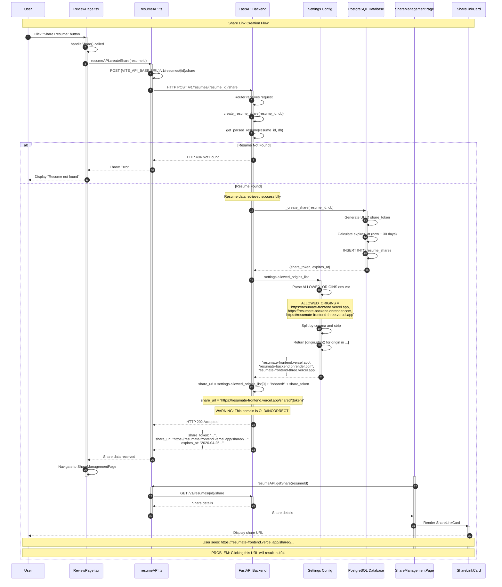
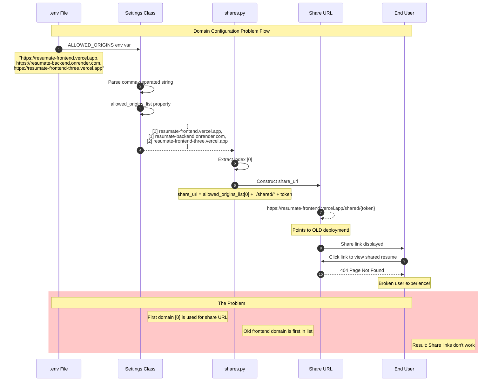
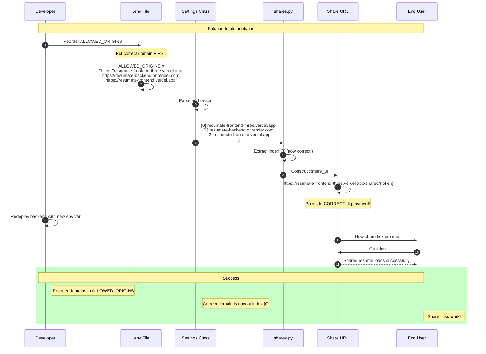
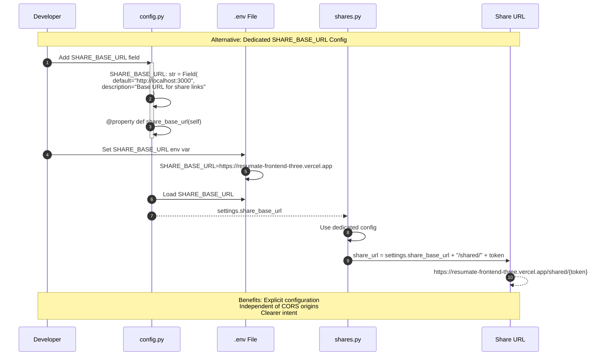

# ResuMate Share Link Creation - Sequence Diagram

> **Document**: Share Link Creation Sequence Diagram  
> **Updated**: 2026-03-26  
> **Type**: Sequence Diagram  

## Mermaid Sequence Diagram

## Problem Analysis Sequence

## Solution Flow

## Alternative Solution: Dedicated Config

